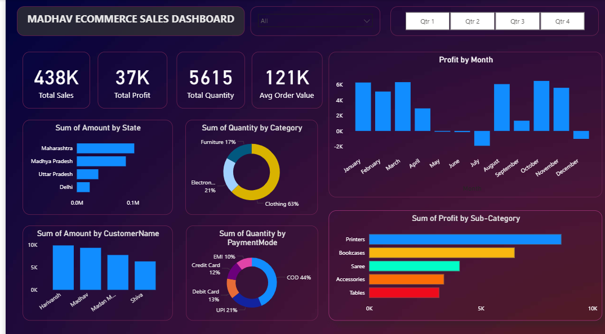

# Madhav Sales Dashboard (Power BI)

## Overview

This project presents an interactive **Sales Dashboard built using Power BI** to analyze the performance of an e-commerce business.
The dashboard provides insights into **sales trends, profit distribution, customer segments, and regional performance**, helping stakeholders understand business performance and make data-driven decisions.

The project demonstrates skills in **data cleaning, data modeling, and dashboard visualization using Power BI.**

---

## Objectives

The main goals of this project are:

* Analyze overall **sales and profit performance**
* Identify **top-performing regions and products**
* Track **customer purchasing behavior**
* Provide **clear visual insights** for business decision making

---

## Tools Used

* **Power BI** – Data visualization and dashboard creation
* **Excel / CSV Dataset** – Data source
* **GitHub** – Project documentation and version control

---

## Dashboard Features

The dashboard includes the following insights:

* **Total Sales and Profit Overview**
* **Sales by Region**
* **Sales by Category**
* **Profit Analysis**
* **Customer Purchase Distribution**
* **Interactive Filters for deeper analysis**

These visuals allow users to quickly explore patterns and trends in the sales data.

---

## Key Insights

Some important insights from the dashboard include:

* Certain regions contribute significantly more to total revenue.
* Some product categories generate higher sales but lower profit margins.
* A small group of customers contributes a large portion of total purchases.
* Sales trends vary across different regions and categories.

These insights help businesses focus on **high-performing products, profitable regions, and customer segments.**

---

## Project Structure

```
Madhav-Sales-Dashboard
│
├── Madhav_Sales_Dashboard.pbix
├── README.md
└── screenshots
      dashboard.png
```

---

## Dashboard Preview

### Main Dashboard



---

## How to Use

1. Download the `.pbix` file from this repository.
2. Open the file using **Microsoft Power BI Desktop**.
3. Explore the dashboard using the available filters and visuals.

